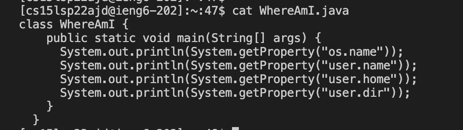

# **Week 2 Lab Report**

1. Installing VScode

    * Download VScode from the website [Link](https://code.visualstudio.com/)

    * Set up the VScode based on your preference. (Sceenshot of my VScode setup)


        

---

2. Remotely Connecting

    * Connecting to SSH (secure shell) requires a terminal.

    * The first 9 characters for all the servers are the same 'cse15lsp22' and mine is 'cs15lsp22ajd'.
    * Typing ssh cs15lsp22ajd@ieng6.ucsd.edu in the terminal initiates the connection and after entering password, you're connected to the server securely.

        

---

3. Trying Some Commands

    * *cd* is change directory which is used to change to a specific directory.

    * ```ls -lat``` is used to listing all the directories. *-lat* is for all
    
        * -a shows all the files
        * -l shows long listing format.
        * -t shows files sorted by time.

        
    
    * ```cat``` is used to show all the contents of the file written after cat.

        
    
---
4. Moving Files with scp

    * In this example, I am securely copying and pasting index.md file to the server.

    * Use ``` scp index.md cs15lsp22zz@ieng6.ucsd.edu:~/ ```
     in the terminal and then login securely to ssh.
    * Type ls and check for index.md to confirm that it has actually been transferred.


    
---
5. Setting an SSH Key
    
    * SSH key is set up to login to the server without having to enter the password everytime you login or do something that requires a password.
 
    * Firstly, type ``` ssh-keygen ``` in the terminal to begin the process.
    * Then enter your file address and just click enter for the key passphrase (do not enter any passphrase).

     
     
     * Then login to your ssh server and enter ``` mkdir .ssh``` and logout.
     * After that, enter 
     ``` scp /Users/amitnamburi/.ssh/id_rsa.pub cs15lsp22ajd@ieng6.ucsd.edu:~/.ssh/authorized_keys ```. Replace the use and username with your credentials.
     * Finally, you can login back again without entering password.

---

Optimizing Remote Running

* In order to make remote running more pleasant, we have a few tricks.

* Adding command at the end of initial ssh command logs into the server, performs the task and then logs out of the server as well. Like this, we can easily perform a simple task without a lot of effort. 

* Example#1 -> 
 ```ssh cs15lsp22ajd@ieng6.ucsd.edu "ls" ``` . This lists out all the files without a lot of effort.
 

    

* Example#2 -> We can use semicolons (;) to run multiple commands at the same time instead of doing them seperately and spending more time.

    


* Another important yet simple tip is to use *UP* key to recall the last command.


---
THE END

---
