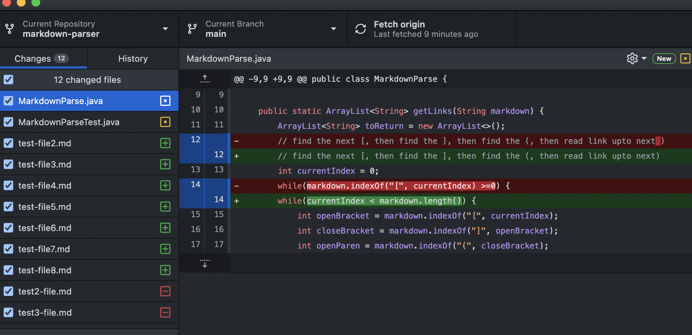
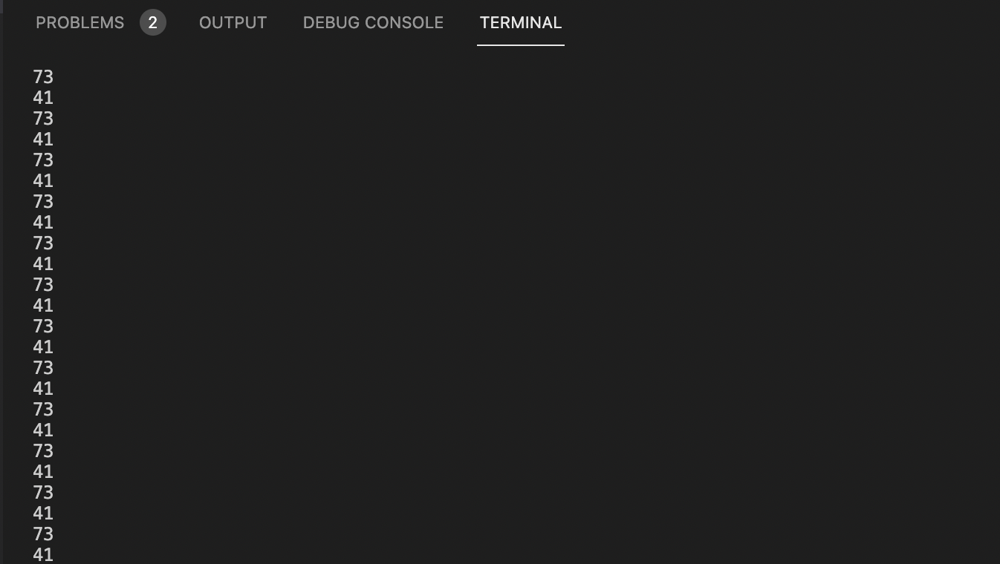
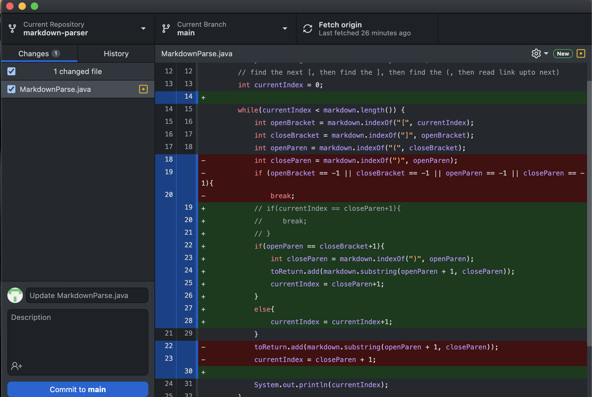
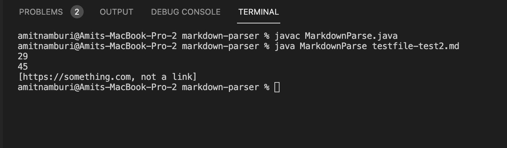
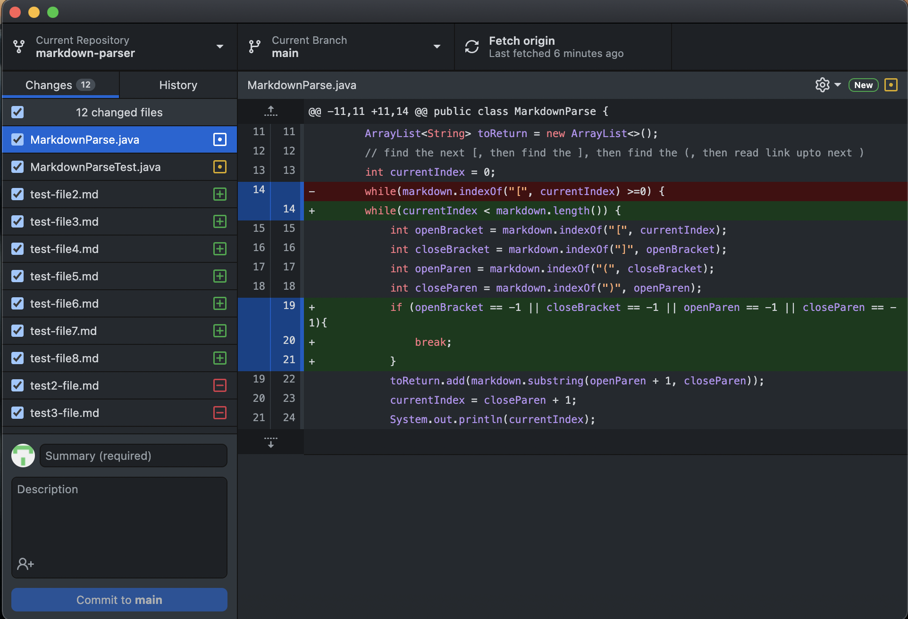
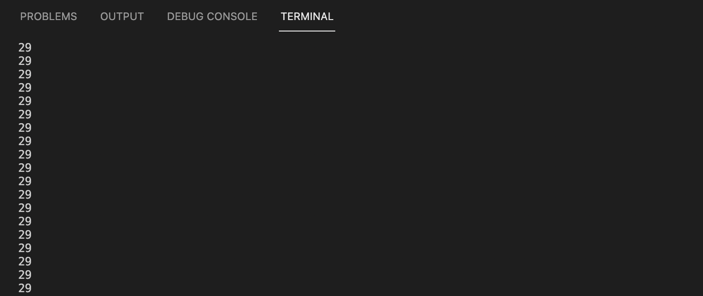

# **Week 3 Lab Report**

## TEST 1

## 1 Show a screenshot of the code change diff from Github

 

 * This is the screenshot of my code changes with my group. 

---

## 2 Link to the test file for a failure-inducing input that prompted you to make that change

* [Link](https://github.com/namburiamit/markdown-parser/blob/main/test-file2.md)

* This is the link to the test file that causes an  failure due to a failure-inducing input.
* It has a space at the end which causes an infinite loop.
---

## 3 Show the symptom of that failure-inducing input by showing the output of running the file at the command line for the version where it was failing (this should also be in the commit message history)



---

## 4 Write 2-3 sentences describing the relationship between the bug, the symptom, and the failure-inducing input.

* In the test file, there was a space at the end which resulted in an infinite loop.
* The value of ```currentIndex``` would remain the same and this leads to the infite loop.

---

## TEST 2

## 1 Show a screenshot of the code change diff from Github

 

 * This is the screenshot of my code changes with my group. 

---

## 2 Link to the test file for a failure-inducing input that prompted you to make that change

* [Link](https://github.com/namburiamit/markdown-parser/blob/main/testfile-test2.md)

* This is the link to the test file that causes an  failure due to a failure-inducing input.

---

## 3 Show the symptom of that failure-inducing input by showing the output of running the file at the command line for the version where it was failing (this should also be in the commit message history)



---

## 4 Write 2-3 sentences describing the relationship between the bug, the symptom, and the failure-inducing input.

* There is a link in the parenthesis after the box brackets '[]' and it still prints out the link even though it is not supposed to.
* There was a gap between '(' and ']' which caused this error. We mustt alter the ode that involves ```currentIndex``` and ```closeParen```.

---

## TEST 3

## 1 Show a screenshot of the code change diff from Github

 

 * This is the screenshot of my code changes with my group. 

---

## 2 Link to the test file for a failure-inducing input that prompted you to make that change

* [Link](https://github.com/namburiamit/markdown-parser/blob/main/testfile-test3.md)

* This is the link to the test file that causes an  failure due to a failure-inducing input.

---

## 3 Show the symptom of that failure-inducing input by showing the output of running the file at the command line for the version where it was failing (this should also be in the commit message history)



---

## 4 Write 2-3 sentences describing the relationship between the bug, the symptom, and the failure-inducing input.

* There is only one open bracket in the file '['. Because of this, there was an infinite loop as the code was searching for a closing bracket and could not find it.
* Hence, adding the code to check if the brackets exist or not helps to prevent this error.
---
