# **Lab Report 3- Amit Namburi**

## Streamlining ssh Configuration

### 1
* This is the ```.ssh/config``` file edited in VScode.

 ``` Host ieng6
    HostName ieng6.ucsd.edu
    User cs15lsp22zzz 
```

* 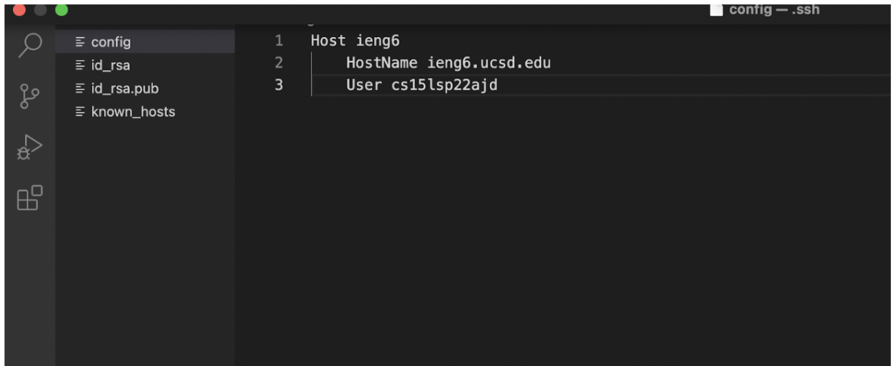

* Adding these lines will make it much easier to login to a specific device.

### 2 

* This is the screenshot of logging into the server
with just a simple command - 
``` ssh ieng6``` 

* 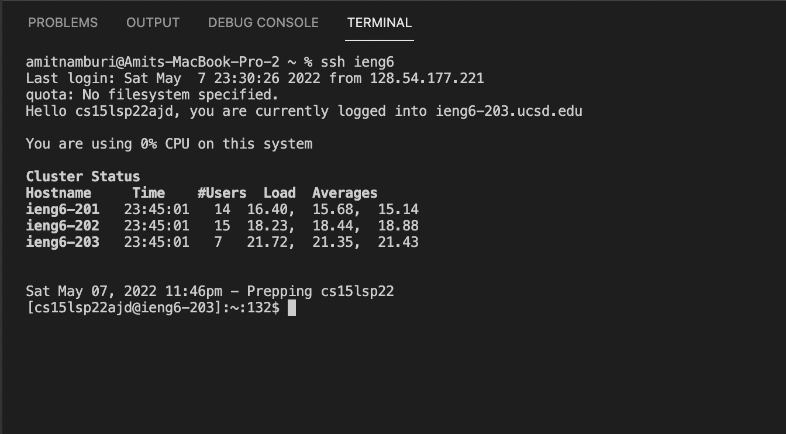

### 3

*  ```scp``` command copying a file to my server account.


* 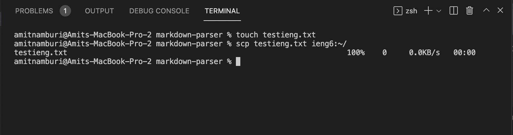

---

## Setup Github Access from ieng6

### 1
* This is where the key-gen is stored on GitHub.
* 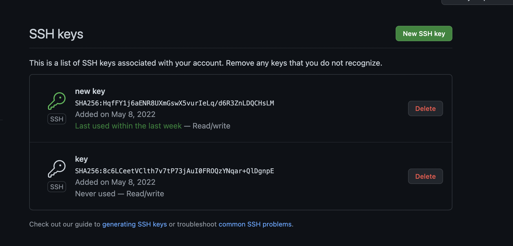

* This is the key in server.
* 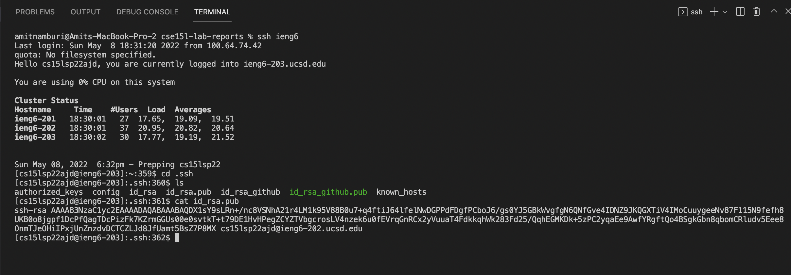


### 2 

* 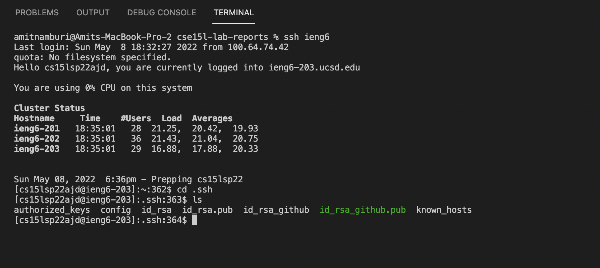

* This is where the key-gen on my personal device in ```.ssh/id_rsa_github.pub```.

### 3

* 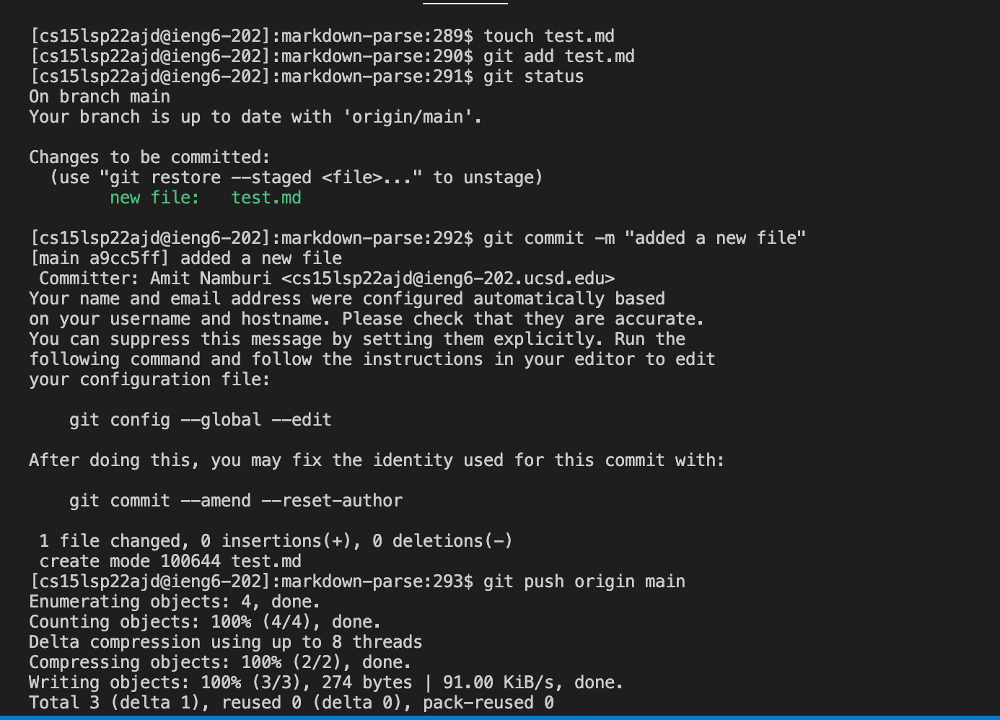

* [Link](https://github.com/namburiamit/markdown-parser/commit/a9cc5ff279f59e46b58604d6cc9e7451300f6ea9) - This link shows the resulting commit.
---

## Copy whole directories with ```scp -r```

* Task 1- Copying the whole markdown-parse file with one command.

```scp -r . cs15lsp22ajd@ieng6.ucsd.edu:~/markdown-parse ```

* 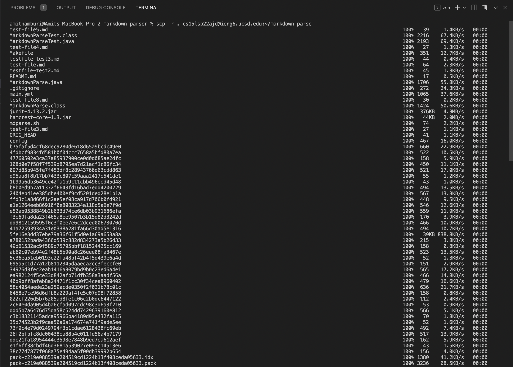
* 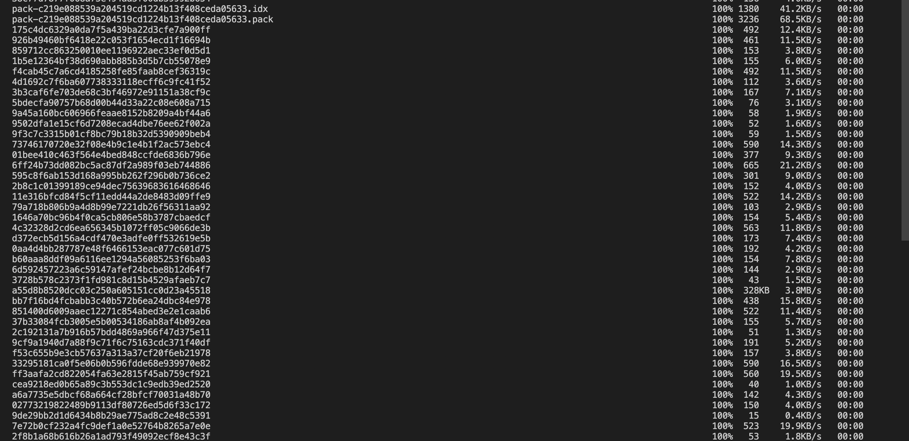
* 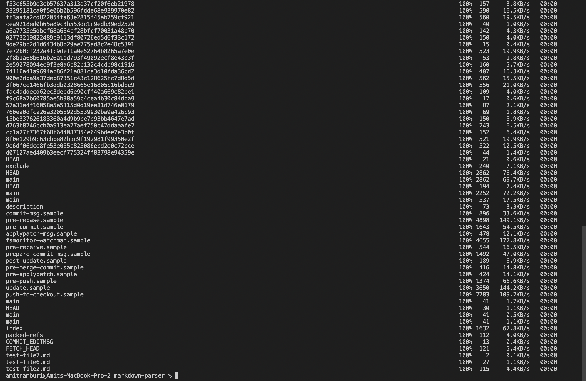


* Task 2-  Logging into your ieng6 account after doing this and compiling and running the tests for your repository.
* 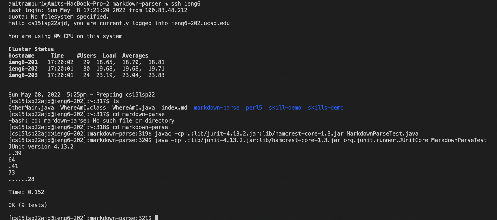


* Task 3 - Combining all the commands using ```;``` and all the tests passed.
* 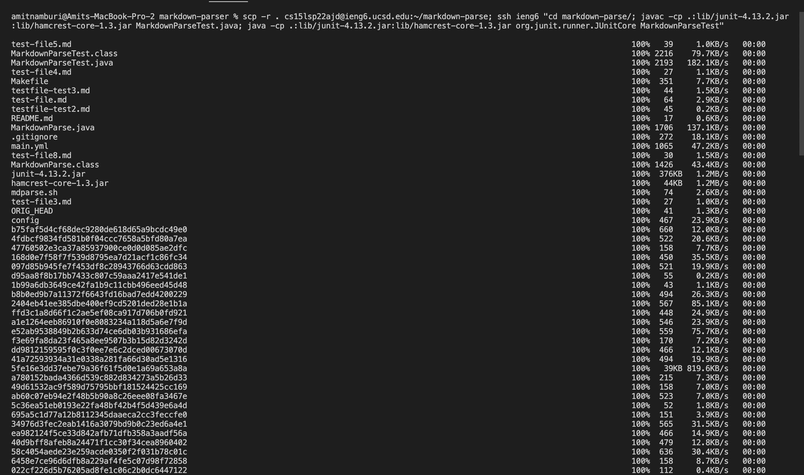
* 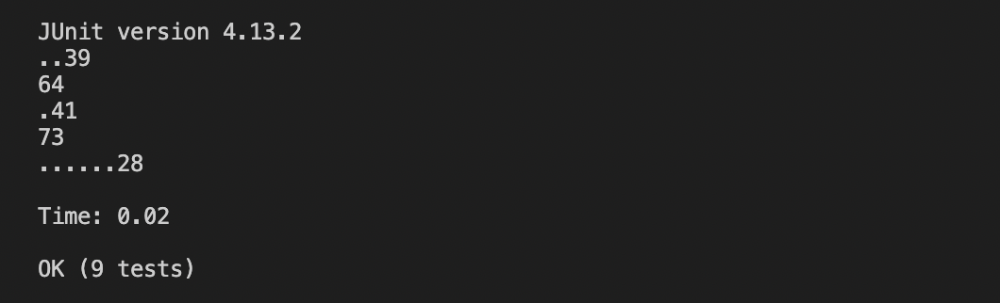

* All the tests have passed using a single command!
---
