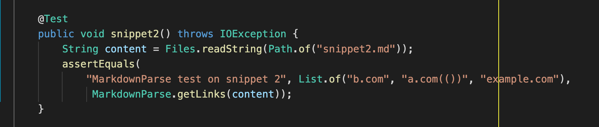

# **Week 8 Lab Report 4**

In this lab report, we will run tests on 3 markdown snippets from my markdown-parse implementation as well as the one I reviewed in week 7.  

### Links to my markdown-parse repository and the one I reviewed in week 7 -

* My markdown-parse - https://github.com/namburiamit/markdown-parser

* Reviewed markdown-parse -  https://github.com/colecarter96/markdown-parser 

---
---

# Snippet 1

This is Snippet 1 -

```
`[a link`](url.com)

[another link](`google.com)`

[`cod[e`](google.com)

[`code]`](ucsd.edu)
```

## Preview of Snippet 1 in VSCode

```
[a link](url.com)

another link`

cod[e

code]
```

## Code in MarkdownParseTest.java 


## My MarkdownParse.java implementation.


## Reviewed MarkdownParse.java implementation.


Question - Do you think there is a small (<10 lines) code change that will make your program work for snippet 1 and all related cases that use inline code with backticks? If yes, describe the code change. If not, describe why it would be a more involved change.

* Yes, I think with a small code change, we can make the MarkdownParse to work for snippet 1.

* If there is a backtick (`) within the square brackets of the link, we should consider that to be a part of the link's name rather than a string beginning/ ending.
--- 
---
# Snippet 2

``` 
[a [nested link](a.com)](b.com)

[a nested parenthesized url](a.com(()))

[some escaped \[ brackets \]](example.com)
```
## Preview of Snippet 2 in VSCode

```
[a nested link](b.com)

a nested parenthesized url

some escaped [ brackets ]
```


## Code in MarkdownParseTest.java 




## My MarkdownParse.java implementation.


## Reviewed MarkdownParse.java implementation.


Question - Do you think there is a small (<10 lines) code change that will make your program work for snippet 2 and all related cases that use inline code with backticks? If yes, describe the code change. If not, describe why it would be a more involved change.

* No, I do not think with a small code change we can make MarkdownParse to work for snippet 2.

* There is definately a solution to this problem, but it can't be lesser than 10 lines.

* We must check multiple scenarios with open and closed brackets and maybe ignore all the brackets in between the first and last bracket. 
---
---

# Snippet 3

``` 
[this title text is really long and takes up more than 
one line

and has some line breaks](
    https://www.twitter.com
)

[this title text is really long and takes up more than 
one line](
https://sites.google.com/eng.ucsd.edu/cse-15l-spring-2022/schedule
)


[this link doesn't have a closing parenthesis](github.com

And there's still some more text after that.

[this link doesn't have a closing parenthesis for a while](https://cse.ucsd.edu/


)
```
## Preview of Snippet 3 in VSCode

```
[this title text is really long and takes up more than one line

and has some line breaks]( https://www.twitter.com )

this title text is really long and takes up more than one line

[this link doesn't have a closing parenthesis](github.com

And there's still some more text after that.

[this link doesn't have a closing parenthesis for a while](https://cse.ucsd.edu/

)
```

## Code in MarkdownParseTest.java 


## My MarkdownParse.java implementation.


## Reviewed MarkdownParse.java implementation.


Question - Do you think there is a small (<10 lines) code change that will make your program work for snippet 3 and all related cases that use inline code with backticks? If yes, describe the code change. If not, describe why it would be a more involved change.

* Yes, I think with a small code change, we can make the MarkdownParse to work for snippet 3.

* We can check for new lines between the title and links and make sure to consider that case while checking for the brackets.
---
---