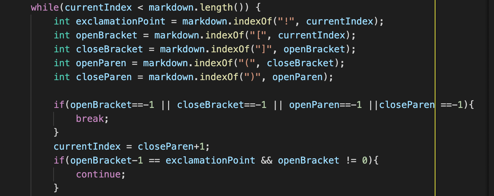

# **Week 10 Lab Report 5**

## How you found the tests with different results?

* I manually searched through the test file.

## Test 1 : Test File - 495.md

* Link to the test file - [Link](https://github.com/nidhidhamnani/markdown-parser/blob/main/test-files/495.md)

### Provided Implementation of MarkdownParse - output

```
[foo(and(bar))]
```

### My Implementation of MarkdownParse - output

```
[foo(and(bar]
```

### Expected Output

```
[foo(and(bar))]
```

### Describe which implementation is correct, or neither if both give the wrong output

* The provided implementation is correct and my implmentation is incorrect.

### Bug description and required modifications - 



* The line ``` int closeParen = markdown.indexOf(")", openParen); ``` does not take into account for the case where there could be multiple closing brackets ")" and hence the output is different from the expected value.


---
---


## Test 2 : Test File - 504.md

* Link to the test file - [Link](https://github.com/nidhidhamnani/markdown-parser/blob/main/test-files/504.md)

### Provided Implementation of MarkdownParse - output

```
[]
```

### My Implementation of MarkdownParse - output

```
[/url "title", /url 'title', /url (title]
```

### Expected Output

```
[/url "title", /url 'title', /url (title)]
```


### Describe which implementation is correct, or neither if both give the wrong output

* Both of our implmentations do not match the expected output. 

* The provided implementation has ``` [] ``` as output.

* My implementation misses the ending bracket and has 
``` [/url "title", /url 'title', /url (title] ``` as the output.

### Bug description and required modifications


* The line ```int closeBracket = markdown.indexOf("]", openBracket); ``` checks for "]" bracket and does not check if ")" exists before the "]". Hence, we can add an if statement to check that condition.


---
---
